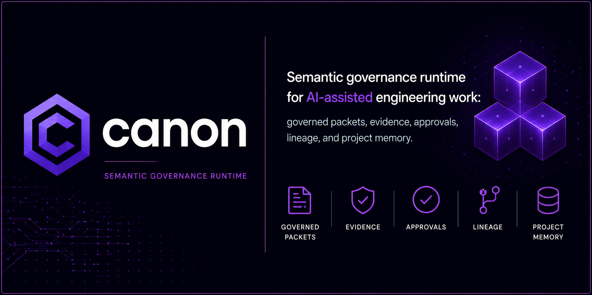

# Canon



[](https://github.com/apply-the/canon/releases)
[](LICENSE)
[](https://github.com/apply-the/canon/actions/workflows/ci.yml)
[](https://github.com/apply-the/canon/actions/workflows/lint.yml)
[](https://github.com/apply-the/canon/actions/workflows/vulnerabilities.yml)
[](https://codecov.io/gh/apply-the/canon)
[](https://sonarcloud.io/summary/new_code?id=apply-the_canon)
[](https://sonarcloud.io/summary/new_code?id=apply-the_canon)
[](https://sonarcloud.io/summary/new_code?id=apply-the_canon)

**The governance runtime for AI-assisted engineering.** Keep AI agents bounded, inspectable, and safely restricted to approved work zones.

## 🚀 Why Canon?

- 🚫 **No Opaque Loops:** You control exactly when agents plan, run, and publish.
- 🛡️ **Bounded Execution:** Agents operate strictly within approved risk and zone limits.
- 🔍 **Inspectable State:** Every decision, approval, and output is captured as durable evidence.
- 📖 **Governed Packets:** Turn unstructured chat into canonical, versioned markdown artifacts.

## 🧠 How it Works

Canon operates on a simple, predictable four-step mental model:
1. `init` -> Prepare the workspace.
2. `run` -> Start a governed session with explicit boundaries.
3. `approve` -> Review and unblock the agent when human judgment is needed.
4. `publish` -> Promote the final artifacts into your repository's permanent memory.

## ⚡ Quick Start

Get your first governed session running in seconds:

```bash
brew tap apply-the/canon && brew install canon
cd my-project
canon init
canon run --mode requirements --risk bounded-impact
```

In supported interactive terminals, `canon init` now opens a guided assistant
selector by default. Use `canon init --non-interactive` for scripts, CI, or
machine-readable output such as `--output json`. The guided selector includes
Codex, Copilot, Claude, Cursor, and Antigravity.

The public documentation is aligned with `0.65.0`. Where the site links back
to repository source, it now points at the `0.65.0` release line.

Canon now publishes `governed_reasoning_posture_v2` as the current stable
reasoning-posture contract for downstream consumers. The new line keeps Canon
as the semantic owner while making selector shape, independence minima,
confidence handoff, provenance, compatibility windows, and active-versus-legacy
migration rules explicit and fail-closed.

## 🛠️ Key Commands

These are the commands you'll actually use every day:

| Command | What it does |
|---|---|
| `canon run` | Start a new governed session with explicit boundaries. Available modes include `requirements`, `architecture`, `brainstorming`, `debugging`, `change`, `incident`, and more. |
| `canon status` | See exactly what the agent is doing right now. |
| `canon inspect` | Review generated evidence and artifacts. |
| `canon approve` | Unblock a session that hit a governance gate. |
| `canon publish` | Commit the final work into your repository. |

## 📚 Deep Dive Documentation

For advanced integrations, semantics, and architecture, explore the `tech-docs/` folder:
- [Getting Started Guide](tech-docs/guides/getting-started.md)
- [Governance Modes](tech-docs/guides/modes.md)
- [Risk and Authority Zones](tech-docs/guides/risk-and-zone.md)
- [Machine-Facing Governance Adapter](tech-docs/integration/governance-adapter.md)

## 🤝 Contributing
Want to build or develop Canon itself? See [CONTRIBUTING.md](CONTRIBUTING.md). Use the GitHub issue templates under `.github/ISSUE_TEMPLATE/` when reporting bugs or feature requests. For vulnerabilities, follow [SECURITY.md](SECURITY.md).
