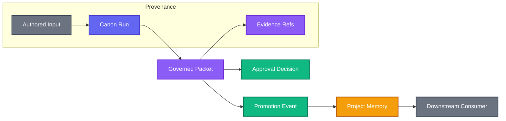

# Lineage And Provenance

Lineage and provenance explain where Canon knowledge came from, how it changed, and what consumed it later.

## What Lineage Records

Lineage should make a packet traceable through:

The purpose is not bureaucracy.
 It is the ability to answer, months later, why a claim exists and whether it can still be trusted.

## Why Provenance Matters

AI-assisted work can look authoritative even when it is based on weak context. Provenance keeps the source visible.

Provenance helps answer:

- who or what authored the input?
- which files or observations grounded the packet?
- which assistant-generated content was later reviewed?
- which claims are evidence-backed?
- which claims are assumptions?
- what changed between draft and publication?

Without provenance, project memory becomes an accumulation of polished but unaccountable text.

## Claim Traceability

A useful packet lets readers trace important claims back to evidence.

For example:

- a security finding should point to config, code, dependency data, or threat context
- an architecture decision should point to constraints, alternatives, and consequences
- a domain invariant should point to domain evidence, workflows, or existing behavior
- a verification conclusion should point to exact checks or artifacts

If a claim cannot be traced, keep it as an assumption or open question instead of promoting it.

## Promotion Auditability

When packet content is promoted into project memory, it must remain auditable.

Promotion should preserve:

- source packet
- source document
- evidence summary
- approval state
- promotion timestamp or event
- compatibility notes
- known limitations

Promoted content should not become detached from its origin. The promoted memory is more useful when it can still answer why it exists.

## Downstream Consumption

Downstream systems should store packet refs and metadata, not just copied prose. Stable refs make it possible to refresh, verify, or reject knowledge later.

For machine-facing integration, use Canon's adapter response fields and authority metadata rather than scraping human summaries.
