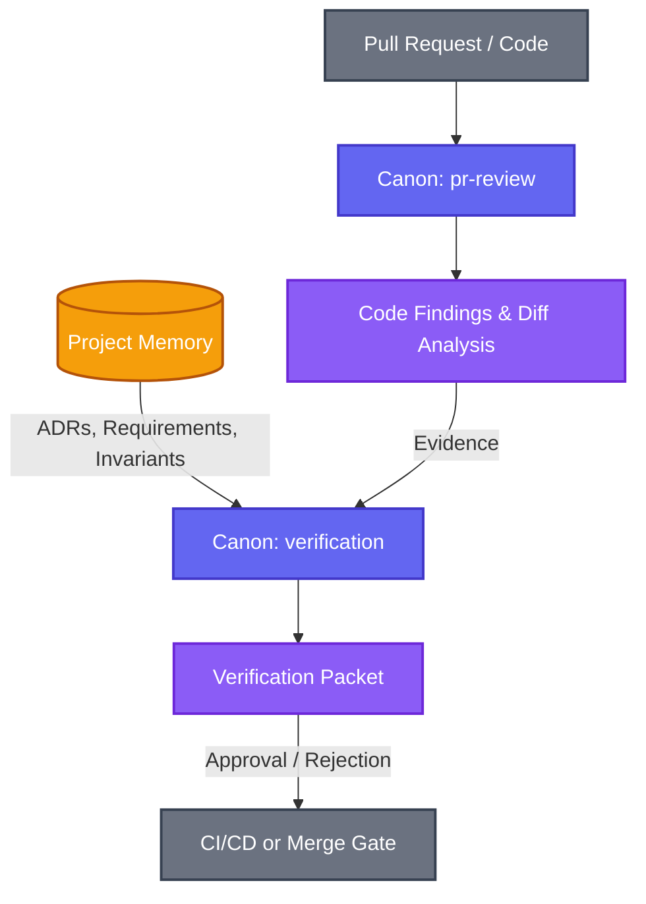
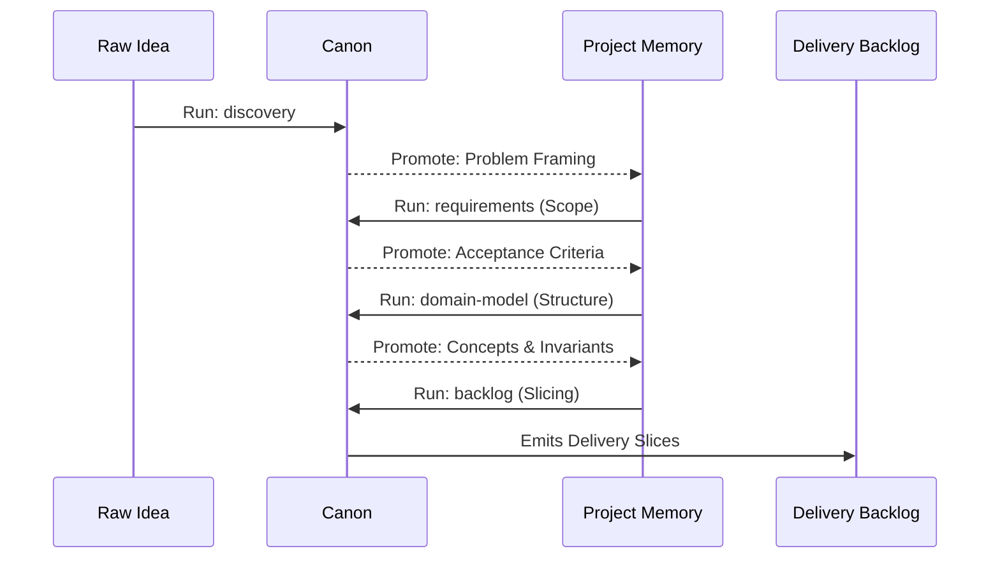
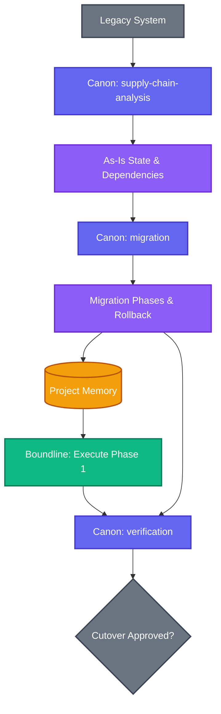

# Examples By Mode

These examples show how to think about specific Canon modes in isolation. They are useful when you need to understand the bounded intent of a single governance action.

## Discovery
Use `discovery` when the problem space is still ambiguous.

**Scenario**: "Customers need a better way to recover failed imports."
**Expected packet outcome**:
- problem framing
- observations
- opportunity areas
- open questions
- evidence refs
- recommendation for next mode

## Requirements
Use `requirements` when discovery is sufficient and the team needs bounded scope.

**Expected packet outcome**:
- requirements summary
- scope cuts
- tradeoffs
- acceptance criteria
- evidence
- unresolved questions

## Domain-Language
Use `domain-language` when terms are inconsistent.

**Expected packet outcome**:
- accepted terms
- deprecated terms
- ambiguous terms
- examples of correct usage

## Domain-Model
Use `domain-model` when terms are mostly stable but relationships are not.

**Expected packet outcome**:
- concepts, relationships, invariants
- bounded contexts
- feature-impact rules

## Architecture
Use `architecture` when a structural decision is ready.

**Expected packet outcome**:
- context, decision, alternatives, rationale
- consequences, evidence, approval posture

## Backlog
Use `backlog` after upstream scope and structure are bounded.

**Expected packet outcome**:
- delivery slices, sequencing, dependencies
- acceptance signals, risks

## Migration
Use `migration` for a bounded move from source to target.

**Expected packet outcome**:
- source and target map
- phases, compatibility constraints, rollback

## Security Assessment
Use `security-assessment` when threats, mitigations, or gaps need governed review.

**Expected packet outcome**:
- scoped target, findings
- threat description, mitigations, residual risk

## Verification
Use `verification` to challenge a claim.

**Expected packet outcome**:
- claim under test
- checks performed, results
- evidence, conclusion


# Flow: The Governed Code Review

This flow shows how to use Canon to evaluate a Pull Request not just for syntax, but for structural adherence to previously governed decisions (Architecture, Requirements, Domain Model).

## The Flow



## Step 1: `pr-review` (The Local Analysis)
First, use Canon to analyze the raw code changes.

**Authored Input:**
Point Canon at the git branch or PR diff. Ask it to summarize the technical delta, find unhandled edge cases, or point out immediate security smells.

**Outcome:** 
A `pr-review` packet containing factual findings about *what* changed, independent of the business context. Its `conventional-comments.md` artifact keeps explicit scope on every comment and may add host-agnostic anchors such as `surface:start` or `surface:start-end` when the persisted diff supports that precision.

## Step 2: `verification` (The Governance Challenge)
Now, elevate the review. Use the output of the `pr-review` as evidence, and ask Canon to challenge the PR against your stable Project Memory.

**Authored Input:**
```markdown
Verify the findings from the recent `pr-review` packet against our approved Architecture (03-async-import-decision.md) and our Domain Invariants.
Specifically check:
1. Does this PR introduce synchronous blocking calls during import?
2. Does it expose the deprecated term `import_error` in the new API?
```

**Outcome:**
A `verification` packet that explicitly concludes whether the PR violates governed standards. 
If it passes, the packet receives an "Approved" state, allowing Boundline or a CI system to confidently merge it. If it fails, it provides the exact trace back to the ADR or Requirement that was ignored.


# Flow: The Feature Inception

This flow illustrates how an ambiguous idea is progressively refined into actionable, governed delivery slices. It prevents the common mistake of jumping directly from an idea to a Jira ticket.

## The Flow



## Step 1: `discovery` (Problem Framing)
**Intent:** Uncover what we don't know.
**Input:** A rough product brief or customer complaint ("Users are confused by the dashboard").
**Outcome:** A packet that maps the opportunity area, gathers evidence from user research, and identifies open questions.

## Step 2: `requirements` (Scoping)
**Intent:** Draw the boundaries.
**Input:** The `discovery` packet.
**Outcome:** We define exactly what we are building, what we are explicitly *not* building (non-goals), and what the acceptance signals will be. We promote the stable scope to Project Memory.

## Step 3: `domain-model` (Structuring)
**Intent:** Align the vocabulary and logic.
**Input:** The approved `requirements`.
**Outcome:** Before coding, we ensure the new feature respects existing bounded contexts and define new invariants.

## Step 4: `backlog` (Decomposition)
**Intent:** Create bounded execution units.
**Input:** The `requirements` and `domain-model`.
**Outcome:** Canon decomposes the work into delivery slices. These slices are now deeply traceable (Lineage): if a developer asks *why* a ticket exists, the lineage points back through the model, requirements, and discovery packets.


# Flow: The Incident Post-Mortem

This flow demonstrates how Canon turns the chaotic aftermath of a production incident into durable, governed structural improvements.

## The Flow



```mermaid
graph LR
    Logs[Incident Logs/Chats] --> Inc_Run[Canon: incident]
    Inc_Run --> Impact[Impact & Containment Packet]
    
    Impact --> Sys_Run[Canon: system-assessment]
    Sys_Run --> Debt[Technical Debt Findings]
    
    Debt --> Mit_Run[Canon: architecture or change]
    Mit_Run --> Decision[Published Packet / Optional ADR]
    
    Decision --> Promoted[(Project Memory)]
    
    classDef canon fill:#6366f1,stroke:#4338ca,stroke-width:2px,color:#fff;
    classDef packet fill:#8b5cf6,stroke:#6d28d9,stroke-width:2px,color:#fff;
    classDef memory fill:#f59e0b,stroke:#b45309,stroke-width:2px,color:#fff;
    classDef external fill:#6b7280,stroke:#374151,stroke-width:2px,color:#fff;
    
    class Inc_Run,Sys_Run,Mit_Run canon;
    class Impact,Debt,Decision packet;
    class Promoted memory;
    class Logs external;
```

## Step 1: `incident` (Capture & Containment)
**Intent:** Record the facts while they are fresh.
**Input:** Raw Slack transcripts, Datadog logs, and the immediate fix applied.
**Outcome:** A packet that formally documents the impact, the timeline, and the containment strategy, without jumping to architectural conclusions.

## Step 2: `system-assessment` (Root Cause & Gap Analysis)
**Intent:** Evaluate the system state that allowed the incident.
**Input:** The `incident` packet.
**Outcome:** Canon analyzes the system's current posture against the incident facts, identifying gaps in monitoring, missing invariants, or architectural flaws.

## Step 3: `architecture` or `change` (Structural Mitigation)
**Intent:** Decide how to prevent recurrence.
**Input:** The `system-assessment` findings.
**Outcome:** An `architecture` packet (for a Type 1 structural shift) or a `change` packet (for a bounded fix). `architecture` publishes a durable ADR by default; `change` stays packet-only unless you publish with `--adr`. In either case, the governed decision can be published and promoted to Project Memory so future developers inherit the constraint born from the incident.


# Flow: The Legacy Migration

This flow shows how Canon governs a high-risk transition from an old system to a new one, ensuring constraints and compatibility windows are respected.

## The Flow



## Step 1: `supply-chain-analysis` / `system-assessment` (The Map)
**Intent:** Understand what you are replacing.
**Input:** Existing legacy code, SBOMs, or runtime configurations.
**Outcome:** A factual packet detailing all dependencies, undocumented behaviors, and current vulnerabilities.

## Step 2: `migration` (The Plan)
**Intent:** Design a safe, bounded transition.
**Input:** The As-Is packet and the target architecture.
**Outcome:** A migration packet that explicitly defines the source-to-target mapping, the phases (e.g., dual-write, shadow read, cutover), compatibility constraints, and the rollback strategy.

## Step 3: `verification` (The Cutover Gate)
**Intent:** Prove the new system is ready.
**Input:** The migration constraints and the runtime metrics from the shadow phase.
**Outcome:** Before flipping the switch, a `verification` run challenges the metrics against the required compatibility constraints. Only if the packet reaches an "Approved" state is the execution orchestrator (like Boundline) allowed to proceed with the final cutover.


