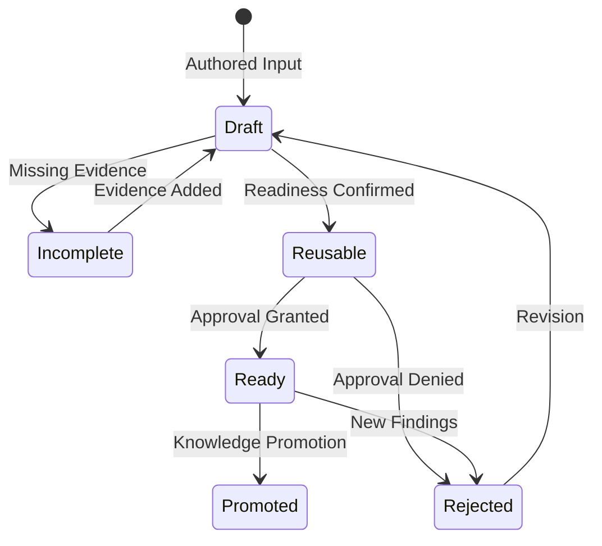

# Core Concepts

Canon is built around a small set of governance concepts. Understanding these makes the modes and packet lifecycle much easier to use.

## Governed Packets

A governed packet is a structured body of engineering knowledge produced for one mode and one bounded purpose.



It should make clear:

- what question or work it governs
- which input shaped it
- what documents were produced
- what evidence supports the claims
- what approval state applies
- what remains uncertain
- what downstream work may rely on it

Packets are not generic notes. They are mode-shaped, evidence-backed, and traceable.

## Modes

A mode is the type of governed work being performed.

Examples:

- `discovery` explores ambiguity
- `requirements` stabilizes scope and outcomes
- `architecture` records structural decisions
- `change` frames bounded modification
- `verification` challenges claims
- `incident` captures operational response knowledge

Use [Canon Modes](./canon-modes) to choose the correct mode.

## Ordered Documents

Packets should be easy to read in the intended sequence. Canon favors ordered document names such as:

```text
01-context.md
02-findings.md
03-decisions.md
04-evidence.md
```

The exact set depends on the mode. The prefix is not decoration; it prevents unordered artifact sprawl and helps downstream consumers know where to start.

## Evidence

Evidence is the support behind packet claims. It can include:

- authored briefs
- source files
- command output
- test results
- logs
- reviewer comments
- incident observations
- dependency or vulnerability data
- prior packet refs

Evidence should be specific enough that another person can evaluate the claim later.

## Approval State

Approval state records whether a packet is accepted for downstream reliance.

The important distinction is simple: generated content is not automatically accepted knowledge. Approval makes the human or governance boundary explicit.

## Readiness

Readiness describes whether a packet is usable yet.

A packet can be:

- incomplete because it lacks context or evidence
- reusable for a bounded downstream purpose
- rejected because it should not be consumed
- blocked because approval or clarification is missing

Readiness should guide publication and downstream consumption.

## Lineage

Lineage answers where a claim came from and what consumed it later.

Useful lineage lets a reader trace:

- source authored input
- Canon run identity
- emitted packet documents
- evidence records
- approval decisions
- promotion events
- downstream consumers

## Project Memory

Project memory is durable, governed knowledge promoted out of a single session or packet.

It is for knowledge that should remain visible and reusable:

- accepted domain terms
- domain concepts and invariants
- architecture decisions
- security findings
- verification results
- migration rationale
- evidence summaries

Project memory should not become a dumping ground for every generated note.

## Promotion

Promotion is the act of moving packet knowledge into a durable memory or documentation surface.

Promotion should preserve:

- source packet refs
- evidence refs
- approval state
- compatibility expectations
- update strategy

Use [Publishing And Promotion](../architecture/publishing-and-promotion) before promoting content.

## Semantic Authority

Semantic authority is Canon-owned governed meaning that downstream tools should respect. It includes vocabulary, authority zones, change classes, personas, approval state, and packet readiness.

### Semantic Layers

Canon separates semantic posture into two layers:
1. **Authority Governance (`authority-governance-v1`)**: The required baseline contract that describes the formal governed posture.
2. **Adaptive Governance (`adaptive-governance-v1`)**: An optional, additive companion semantic layer that describes governance maturity terms (like *rollout profiles* such as `guided` or `strict`, and *governance states* like `advisory` or `rule`) without assigning runtime execution behavior.

Downstream tools (like Boundline) should consume Canon's authority metadata rather than inferring meaning from filenames or prose. They use these semantics to determine runtime confidence, trust, and execution boundaries.
