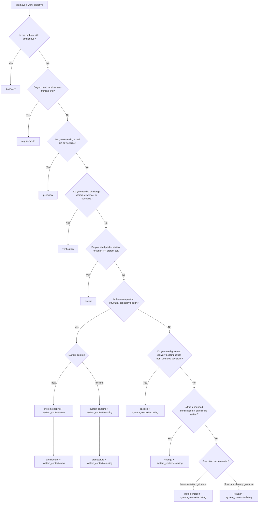
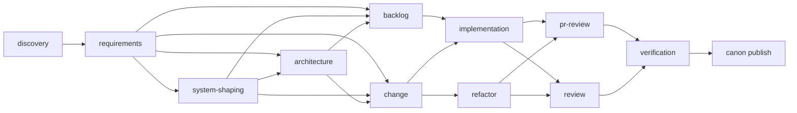
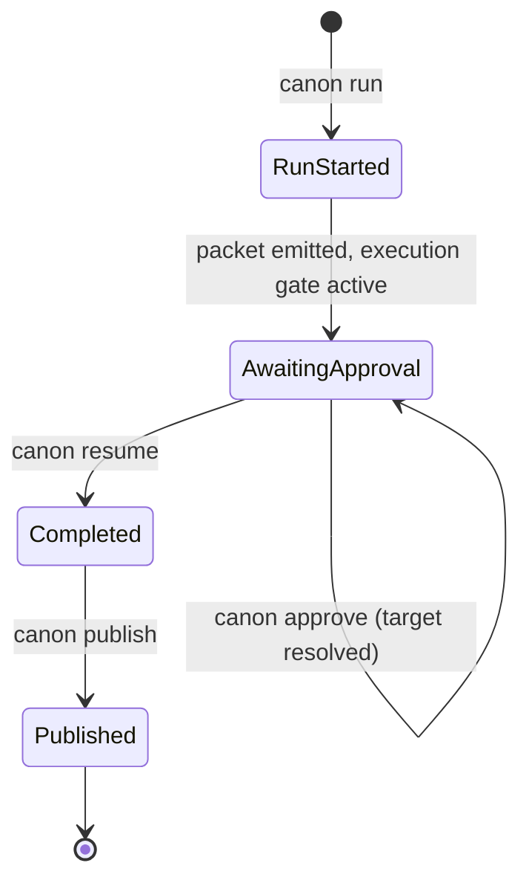
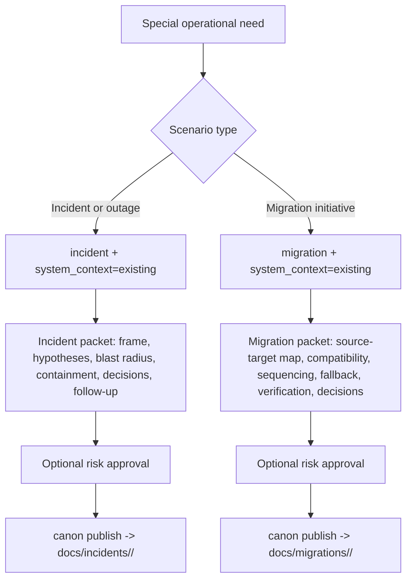

# Canon Mode Guide

This guide explains what each implemented Canon mode is for, what input it
expects, which questions it helps answer, and which questions belong in a
different mode.

Use this guide when you are deciding which mode to run or when you need a
starting template for the `--input` material that Canon consumes.

## Two Axes

Canon is organized around two explicit axes:

- `mode`: what kind of governed work is happening
- `system_context`: whether the target system is new or existing

These axes answer different questions. A mode does not imply system state, and
system state does not imply the kind of work. When Canon needs target-state
binding, it requires `--system-context` explicitly instead of hiding that
choice in the mode name.

## How Canon Uses AI

Canon is a governed AI companion, not a generator that calls an LLM by itself.
The Canon CLI is responsible for:

- creating runs with explicit owner, risk, and zone
- snapshotting authored input with digest-backed provenance
- emitting contract-shaped artifact stubs
- applying gates and policy
- persisting evidence, decisions, and approval state

The artifact **content** is generated by your AI assistant (Copilot, Codex,
Claude). The repo-local Canon skills under `.agents/skills/` instruct the
assistant to:

1. read the authored input itself
2. invoke the Canon CLI to create the run skeleton
3. produce real artifact content grounded in the input
4. run a critique pass against its own output
5. overwrite the templated stubs with the generated content
6. write an `ai-provenance.md` sidecar that records source documents,
   approach, and unresolved findings

Here, "templated stubs" means Canon-managed files under `.canon/artifacts/<RUN_ID>/...`.
The assistant must treat authored inputs under `canon-input/` as read-only and
must never rewrite them as part of generation or critique.

If you run `canon run` directly without an AI driving the skill flow, you get
the structural stubs only. Those stubs are not the requirements result; they
are scaffolding for the AI to fill.

This split keeps governance and persistence in one durable place while letting
the AI surface bring real domain reasoning. Canon does not depend on a
specific LLM provider; the assistant in the chat is the model.

## Quick Decision Rule

- use `system-shaping` when the structure of a capability is not yet defined
- use `backlog` when upstream scope is already bounded and the next need is
  governed delivery decomposition rather than execution guidance
- use `change` when the structure is known and the task is bounded
  modification with preserved behavior
- use `system-shaping --system-context existing` when you are working inside
  an existing system but the next need is still structural, not modification

## Supported Today

- [`discovery`](#mode-discovery)
- [`requirements`](#mode-requirements)
- [`system-shaping`](#mode-system-shaping)
- [`architecture`](#mode-architecture)
- [`backlog`](#mode-backlog)
- [`change`](#mode-change)
- [`implementation`](#mode-implementation)
- [`refactor`](#mode-refactor)
- [`review`](#mode-review)
- [`verification`](#mode-verification)
- [`pr-review`](#mode-pr-review)
- [`incident`](#mode-incident)
- [`migration`](#mode-migration)

## Input Binding Rules

For file-backed modes, Canon now has a single canonical authored-input
convention:

- `requirements`: `canon-input/requirements.md` or `canon-input/requirements/`
- `discovery`: `canon-input/discovery.md` or `canon-input/discovery/`
- `system-shaping`: `canon-input/system-shaping.md` or `canon-input/system-shaping/`
- `architecture`: `canon-input/architecture.md` or `canon-input/architecture/`
- `backlog`: `canon-input/backlog.md` or `canon-input/backlog/`
- `change`: `canon-input/change.md` or `canon-input/change/`
- `implementation`: `canon-input/implementation.md` or `canon-input/implementation/`
- `incident`: `canon-input/incident.md` or `canon-input/incident/`
- `migration`: `canon-input/migration.md` or `canon-input/migration/`
- `refactor`: `canon-input/refactor.md` or `canon-input/refactor/`
- `review`: `canon-input/review.md` or `canon-input/review/`
- `verification`: `canon-input/verification.md` or `canon-input/verification/`

Repo-local skills may auto-bind only from those canonical mode-specific
locations. They must not treat the active editor file, open tabs, generated
artifacts under `.canon/`, or any other incidental file as the current run
input.

`canon run` and `canon inspect risk-zone` also accept explicit inline authored
input through `--input-text`. Inline input is an explicit alternative, not a
new canonical location, and real runs snapshot it only under
`.canon/runs/<RUN_ID>/inputs/`.

If you prefer to keep a mode brief as a folder, Canon expands the files in that
folder into the run context and fingerprints each authored file separately.

For `implementation` and `refactor`, a folder-backed packet is the preferred
way to carry forward bounded context from earlier packets. Keep the current
mode brief in `brief.md`, record upstream packet references in `source-map.md`,
and add `selected-context.md` only when a broader upstream packet needs to be
narrowed to the current feature slice. Canon still judges readiness from the
current mode brief; it does not implicitly dereference prior `.canon/` runs,
published `docs/` packets, or `@last`.

Every mode that expects authored input now fails before execution if the input
is missing, empty, whitespace-only, or structurally insufficient. That includes
empty files, empty directories, and directory expansions that produce no usable
authored content.

Modes that target a specific system state also require an explicit
`--system-context` binding. Use `--system-context new|existing` for
`system-shaping` and `architecture`; use `--system-context existing` for
`backlog`, `change`, `implementation`, `incident`, `migration`, and `refactor`.

`review` is stricter in the current runtime slice: it expects exactly one
authored review packet at `canon-input/review.md` or `canon-input/review/`.
Do not point it at arbitrary code folders such as `src/` or the repo root.
Use `pr-review` when the real target is a diff or `WORKTREE`.

`pr-review` is different. It does not bind from `canon-input/` at all. It only
accepts explicit base and head refs, or `WORKTREE` as the head ref.

When a run starts from authored files, Canon snapshots those files under
`.canon/runs/<RUN_ID>/inputs/` and records digest-backed provenance in
`.canon/runs/<RUN_ID>/context.toml`.

## Publish / Promotion

Canon keeps run artifacts under `.canon/` because they are governed runtime
evidence, not automatically the repository's living documentation.

When a packet is approved and the run is fully complete, publish it into a
visible repository folder with:

```bash
canon publish <RUN_ID>
canon publish <RUN_ID> --to docs/custom/path
```

Publishing copies the emitted artifact files out of `.canon/artifacts/` and
into a visible workspace directory. It never mutates or deletes the governed
copy under `.canon/`.

Publishing is allowed for runs whose state is `Completed`. `incident` and
`migration` are the exception: approval-gated or blocked operational packets
may also publish when the emitted artifact set exists and the goal is packet
review outside the runtime.

Default publish targets by mode:

- `requirements` -> `specs/<RUN_ID>/`
- `discovery` -> `docs/discovery/<RUN_ID>/`
- `system-shaping` -> `docs/architecture/shaping/<RUN_ID>/`
- `architecture` -> `docs/architecture/decisions/<RUN_ID>/`
- `backlog` -> `docs/planning/<RUN_ID>/`
- `change` -> `docs/changes/<RUN_ID>/`
- `implementation` -> `docs/implementation/<RUN_ID>/`
- `incident` -> `docs/incidents/<RUN_ID>/`
- `migration` -> `docs/migrations/<RUN_ID>/`
- `refactor` -> `docs/refactors/<RUN_ID>/`
- `review` -> `docs/reviews/<RUN_ID>/`
- `verification` -> `docs/verification/<RUN_ID>/`
- `pr-review` -> `docs/reviews/prs/<RUN_ID>/`

Use `--to <PATH>` when the default destination is not the right public home
for the packet.

## Mode Flows (Mermaid)

This section summarizes the main Canon mode flows across two explicit axes:

- `mode`: what kind of governed work is happening
- `system_context`: whether the target system is `new` or `existing`

### 1) Decision Flow: Which Mode To Run



### 2) End-to-End Flow For Implemented Modes



### 3) Approval Gate Flow For Execution Modes



### 4) Operational Modes (Supported Today)



### 5) Quick Legend

- `discovery` and `requirements` clarify problem boundaries before execution.
- `system-shaping` and `architecture` handle structural design and decisions.
- `change` defines bounded modification scope and preserved invariants.
- `implementation` and `refactor` produce governed execution/preservation packets with approval gating.
- `review`, `verification`, and `pr-review` challenge packet quality, evidence, and diff-level correctness.
- `incident` and `migration` produce recommendation-only operational packets with publishable blocked or approval-gated review surfaces.

## Mode: discovery

### Use It For

Explore a blurry problem space before you can write trustworthy requirements.

### Input Shape

A discovery brief authored with canonical H2 sections. For this first slice, a credible brief includes `## Problem Domain`, `## Repo Surface`, `## Immediate Tensions`, `## Downstream Handoff`, `## Unknowns`, `## Assumptions`, `## Validation Targets`, `## Confidence Levels`, `## In-Scope Context`, `## Out-of-Scope Context`, `## Translation Trigger`, `## Options`, `## Constraints`, `## Recommended Direction`, `## Next-Phase Shape`, `## Pressure Points`, `## Blocking Decisions`, `## Open Questions`, and `## Recommended Owner`.

### Good Input Should Include

- `## Problem Domain` and `## Repo Surface` so the exploration stays tied to a real system surface
- `## Immediate Tensions` and `## Downstream Handoff` so the next mode can inherit the right boundary
- `## Unknowns`, `## Assumptions`, `## Validation Targets`, and `## Confidence Levels` so the packet stays honest about uncertainty
- `## In-Scope Context`, `## Out-of-Scope Context`, and `## Translation Trigger` so the discovery boundary is explicit
- `## Options`, `## Constraints`, `## Recommended Direction`, and `## Next-Phase Shape` so the exploratory path is reviewable
- `## Pressure Points`, `## Blocking Decisions`, `## Open Questions`, and `## Recommended Owner` so the unresolved work is easy to hand off

### Questions This Mode Answers

- what is the real problem to solve
- what are the boundaries of the problem
- which unknowns block a credible next step
- which assumptions are implicit
- which options are worth exploring
- what needs to be decided now versus later

### Questions This Mode Does Not Answer Well

- what the final implementation plan should be
- what the final architecture should be
- what exact delivery sequence to execute
- what code should change

### What Canon Emits

Discovery produces an exploratory packet with these artifacts:

- `problem-map.md`
- `unknowns-and-assumptions.md`
- `context-boundary.md`
- `exploration-options.md`
- `decision-pressure-points.md`

Use that bundle when you need to make the unknowns, assumptions, boundaries,
and decision pressure explicit before a later mode becomes trustworthy.

### Typical Handoff After This Mode

- publish the approved discovery packet with `canon publish <RUN_ID>` to `docs/discovery/<RUN_ID>/`, or use `--to` for a different public destination
- move to `requirements` when the problem boundary is stable enough for explicit framing
- move to `system-shaping` when the team now understands the problem and is ready to shape a new capability
- move to `architecture` when the key remaining work is choosing among structural options

### Common Mistakes

- using Discovery when the problem is already bounded enough for Requirements
- treating Discovery as a place to choose a final implementation plan
- giving it a solution memo instead of a problem-exploration brief

### Example Input

Instead of generic templates, Canon uses realistic bounded documents.
See [docs/examples/canon-input/discovery-legacy-migration.md](docs/examples/canon-input/discovery-legacy-migration.md)
for a populated example of a Discovery brief.

## Mode: requirements

### Use It For

Bound a problem before code, design, or scope drift starts.

### Input Shape

A requirements brief authored with canonical H2 sections. For this first slice, a credible brief includes `## Problem`, `## Outcome`, `## Constraints`, `## Non-Negotiables`, `## Options`, `## Recommended Path`, `## Tradeoffs`, `## Consequences`, `## Scope Cuts`, `## Deferred Work`, `## Decision Checklist`, and `## Open Questions`.

### Good Input Should Include

- `## Problem` and `## Outcome` so the packet can state the bounded intent clearly
- `## Constraints` and `## Non-Negotiables` so delivery and policy boundaries are explicit
- `## Options` and `## Recommended Path` so the packet carries real choice rather than a single unexamined answer
- `## Tradeoffs` and `## Consequences` so reviewers can see the cost of the recommendation
- `## Scope Cuts` and `## Deferred Work` so the first slice stays honest about exclusions
- `## Decision Checklist` and `## Open Questions` so the remaining decisions are explicit before planning or execution

### Questions This Mode Answers

- what exactly are we trying to do
- what constraints and tradeoffs matter
- what options exist
- what should be cut from scope
- what open questions remain before planning or execution

### Questions This Mode Does Not Answer Well

- how a new system should be shaped internally
- which architecture option should win
- how to safely change a legacy surface
- what changed in a pull request

### What Canon Emits

Requirements produces a bounded framing packet with these artifacts:

- `problem-statement.md`
- `constraints.md`
- `options.md`
- `tradeoffs.md`
- `scope-cuts.md`
- `decision-checklist.md`

Use that bundle when the team needs one durable packet that explains the
problem, the constraints, the available options, the tradeoffs, and what still
has to be decided.

### PRD Shape

The Requirements packet IS the Product Requirements Document for the bounded
scope. The AI companion (Copilot, Codex, Claude) generates the artifact
content grounded in the authored input and projects it onto the PRD shape
below. Canon owns the run, the gates, and the persistence; the assistant owns
the domain reasoning.

A Canon PRD is organized as eight sections:

1. Problem — what is broken or missing
2. Users and Stakeholders — who is impacted and who decides
3. Scope In and Scope Out — what is and is not in this packet
4. Functional Requirements — observable behavior the system must support
5. Non-Functional Requirements — performance, reliability, compliance, UX bars
6. Success Criteria — how we know this packet is satisfied
7. Dependencies and Assumptions — what must be true for this to hold
8. Open Questions — what still requires explicit resolution

Mapping rules onto the emitted artifacts:

- `problem-statement.md` carries Problem, Users and Stakeholders, Success Criteria
- `constraints.md` carries Non-Functional Requirements and structural constraints
- `options.md` and `tradeoffs.md` carry Functional Requirement options and their tradeoffs
- `scope-cuts.md` carries Scope In and Scope Out
- `decision-checklist.md` carries Dependencies, Assumptions, and Open Questions

If the authored input does not provide a section, the assistant must record
the gap explicitly in `ai-provenance.md` and in the relevant artifact rather
than inventing content.

### Typical Handoff After This Mode

- publish the approved requirements packet with `canon publish <RUN_ID>` to `specs/<RUN_ID>/`, or use `--to` to place the PRD elsewhere
- move to `discovery` if the problem is still too fuzzy and the unknowns are more important than the framing
- move to `system-shaping` if the problem is bounded and the next step is shaping a new capability
- move to `change` if the work is clearly about a bounded change in an existing system
- move to `architecture` if the main unresolved issue is a structural decision rather than product framing

### Common Mistakes

- using Requirements when the real problem is still ambiguous and needs exploration first
- using Requirements as a substitute for architecture decisions
- putting implementation details into the brief before the scope is credibly bounded

### Example Input

Instead of generic templates, Canon uses realistic bounded documents.
See [docs/examples/canon-input/requirements-api-v2.md](docs/examples/canon-input/requirements-api-v2.md)
for a populated example of a Requirements brief.

## Mode: system-shaping

### Use It For

Shape a new capability structure once the intent is bounded, either for a new
system or for a new capability that will live inside an existing system.

### Input Shape

A system-shaping brief for the `system-shaping` mode with explicit intent and
constraints. A credible first-slice brief now includes `## Goal`, `## Users or
Stakeholders`, `## Domain Responsibilities`, `## Constraints`, `## Risks`,
`## Open Questions`, `## Candidate Bounded Contexts`, `## Core And Supporting
Domain Hypotheses`, `## Ubiquitous Language`, `## Domain Invariants`, and
`## Boundary Risks And Open Questions`, plus the required inline `Intent:` and
`Constraint:` markers. This mode also requires explicit `--system-context
new|existing` when you start the run.

### System Context Guidance

- use `--system-context new` when the capability is shaping a new system from scratch
- use `--system-context existing` when the system already exists but the next question is how a new capability should be structured inside it
- if you can already name the exact system slice, invariants, and change surface, you are no longer shaping; move to `change`

### Important Note

This mode works best when the brief includes explicit markers like:

- `Intent:`
- `Constraint:`

### Good Input Should Include

- the capability to create
- the goal of the system
- explicit intent
- explicit constraints
- key domain responsibilities
- candidate bounded contexts and ubiquitous language
- domain invariants and boundary risks
- major delivery concerns
- main risks or unknowns

### Questions This Mode Answers

- what shape the new system or capability should take
- what boundaries should exist early
- what capabilities are needed
- what delivery options exist
- where the risk hotspots are

### Questions This Mode Does Not Answer Well

- how to change a legacy system safely
- which exact code edits to make now
- how to review an existing diff
- how to govern a live migration or incident

### What Canon Emits

The `system-shaping` mode produces an early system-shaping packet with these
artifacts:

- `system-shape.md`
- `domain-model.md`
- `architecture-outline.md`
- `capability-map.md`
- `delivery-options.md`
- `risk-hotspots.md`

This mode includes mandatory critique, so the emitted packet is not just a raw
design sketch. It is a challenged first structure for a new capability.

### Important Runtime Constraint

This system-shaping mode works best when the input brief includes explicit
`Intent:` and `Constraint:` markers. If those anchors are missing, the emitted
artifacts can carry insufficient-evidence warnings instead of a strong
system-shaping result.

### Typical Handoff After This Mode

- publish the approved system-shaping packet with `canon publish <RUN_ID>` to `docs/architecture/shaping/<RUN_ID>/`, or use `--to` for another public destination
- move to `architecture` when the next step is to settle structural tradeoffs or invariants
- move to `change` when the structure is clear and the next step is a bounded modification in an existing system
- move to `requirements` only if the intent turned out not to be bounded enough after all
- move to downstream execution planning later, once the shaped capability is stable enough to implement

### Common Mistakes

- using `system-shaping` before the problem is bounded
- omitting explicit `Intent:` and `Constraint:` anchors in the brief
- treating system shaping as if it were already implementation planning
- using `system-shaping` for direct bounded modification when the real need is `change`

### Example Input

Instead of generic templates, Canon uses realistic bounded documents.
See [docs/examples/canon-input/system-shaping-billing.md](docs/examples/canon-input/system-shaping-billing.md)
for a populated example of a System Shaping brief.

## Mode: architecture

### Use It For

Make explicit structural decisions about boundaries, invariants, and tradeoffs.

### Input Shape

An architecture brief describing the decision surface, competing options, and
important constraints. This mode also requires explicit
`--system-context new|existing` when you start the run.

For the delivered first slice, a credible brief now includes the existing
decision sections `## Decision`, `## Constraints`, `## Evaluation Criteria`,
`## Decision Drivers`, `## Options Considered`, `## Pros`, `## Cons`,
`## Recommendation`, and `## Why Not The Others`; the ADR-style
`## Consequences` section (with legacy `## Risks` accepted as an input alias);
the existing C4 sections; plus `## Bounded Contexts`,
`## Context Relationships`, `## Integration Seams`,
`## Anti-Corruption Candidates`, `## Ownership Boundaries`, and
`## Shared Invariants`.

### Good Input Should Include

- the design problem
- the main structural options and the explicit rejected alternatives
- important constraints
- candidate boundaries
- invariants that must hold
- decision drivers, recommendation, consequences, and tradeoffs that matter
- risks of the decision when you are still authoring an older brief that has
  not been migrated to `## Consequences`
- bounded contexts, their relationships, and shared invariants

### Questions This Mode Answers

- what boundaries should exist
- what invariants must hold
- what tradeoffs separate the options
- which option is strongest under explicit criteria
- what blockers or accepted risks remain

### Questions This Mode Does Not Answer Well

- what the product problem is if it is still unclear
- how to shape a brand new capability from scratch
- how to preserve legacy behavior in an existing system
- how to review an actual code diff

### What Canon Emits

Architecture produces a structural decision packet with these artifacts:

- `architecture-decisions.md` (ADR-like decision record preserving `Decision`, `Constraints`, `Decision Drivers`, `Recommendation`, and `Consequences`)
- `invariants.md` (mandatory boundary invariants)
- `tradeoff-matrix.md` (alternatives and tradeoff analysis preserving `Options Considered`, `Evaluation Criteria`, `Pros`, `Cons`, and `Why Not The Others`)
- `boundary-map.md` (system boundaries and ownership)
- `context-map.md` (bounded contexts, relationships, seams, ownership, and shared invariants)
- `readiness-assessment.md` (decision readiness and blockers)
- `system-context.md` (C4 Level 1: system and external actors; requires authored `## System Context` in brief)
- `container-view.md` (C4 Level 2: deployable containers; requires authored `## Containers` in brief)
- `component-view.md` (C4 Level 3: component decomposition; requires authored `## Components` in brief)

The decision artifacts and the three C4 artifacts preserve authored sections
verbatim from the architecture brief. If a section is omitted or uses a
non-canonical heading variant, the artifact emits an explicit
`## Missing Authored Body` block referencing the canonical heading rather than
fabricating content. `## Risks` remains accepted as a backward-compatible
input alias and is rendered as `## Consequences` in
`architecture-decisions.md`.

This mode includes mandatory critique and is designed to leave behind a
decision bundle that later work can implement or review without relying on chat
history.

### Approval and Risk Behavior

Architecture can stop in `AwaitingApproval` when the run is `systemic-impact`
or in the `red` zone. That is expected behavior for a structural decision flow,
not a failure in the mode itself.

### Typical Handoff After This Mode

- publish the approved architecture packet with `canon publish <RUN_ID>` to `docs/architecture/decisions/<RUN_ID>/`, or use `--to` for another public destination
- move to `change` when the structural decision now needs a bounded change plan in an existing system
- move to later implementation work once the boundaries and invariants are accepted
- return to `discovery` or `requirements` only if the decision surface itself was not actually bounded

### Common Mistakes

- using Architecture before the problem or capability is clear enough
- confusing architecture tradeoff work with product framing
- asking Architecture to inspect a real code diff instead of using `pr-review`

### Example Input

Instead of generic templates, Canon uses realistic bounded documents.
See [docs/examples/canon-input/architecture-state-management.md](docs/examples/canon-input/architecture-state-management.md)
for a populated example of an Architecture brief.

## Mode: backlog

### Use It For

Turn bounded upstream decisions into a durable backlog packet with epics,
delivery slices, dependencies, sequencing, acceptance anchors, and planning
risks.

### Typical Upstream Sources

- an `architecture` packet whose boundaries and tradeoffs are already explicit
- a `system-shaping` packet whose capability structure is closed enough for
  decomposition
- a bounded backlog brief authored directly under `canon-input/`

### Input Shape

A file-backed backlog brief or packet under `canon-input/backlog.md` or
`canon-input/backlog/`.

For a folder-backed packet, use:

- `brief.md` for the authoritative backlog brief
- `priorities.md` for explicit ordering intent and exclusions
- optional `context-links.md` for carried-forward source references

This mode requires explicit `--system-context existing` when you start the
run.

### Good Input Should Include

- source artifact references that bound the backlog
- delivery intent and planning horizon
- desired granularity
- explicit priorities or exclusions
- known dependency constraints
- out-of-scope or deferred work

### Questions This Mode Answers

- how bounded upstream decisions decompose into epics and slices
- which dependencies and sequencing constraints matter for execution planning
- what acceptance anchors a later implementation lead should preserve
- where closure is still weak enough to block or downgrade decomposition

### Questions This Mode Does Not Answer Well

- what the product problem is if it is still unclear
- how to settle unresolved capability boundaries or ownership questions
- what exact code mutations should happen next
- how to review a real diff

### What Canon Emits

Backlog produces a delivery decomposition packet with these artifacts:

- `backlog-overview.md`
- `epic-tree.md`
- `capability-to-epic-map.md`
- `dependency-map.md`
- `delivery-slices.md`
- `sequencing-plan.md`
- `acceptance-anchors.md`
- `planning-risks.md`

The packet stays above task level. It is meant to remain publishable and
readable outside Canon as a standalone planning artifact.

### Closure and Downgrade Behavior

Backlog does not pretend decomposition is credible when upstream closure is
weak. If source constraints, ownership boundaries, or dependencies are still
materially unresolved, Canon either blocks the run or completes it in a
closure-limited form.

Closure-limited runs emit only:

- `backlog-overview.md`
- `planning-risks.md`

Use that signal to return to `system-shaping` or `architecture` instead of
carrying false precision into execution.

### Typical Handoff After This Mode

- publish the approved backlog packet with `canon publish <RUN_ID>` to `docs/planning/<RUN_ID>/`, or use `--to` for another public destination
- move into `implementation` only after selecting a bounded slice from the packet
- return to `architecture` or `system-shaping` if closure findings show the source decisions are still too weak
- use `dependency-map.md`, `sequencing-plan.md`, and `acceptance-anchors.md` to keep later execution work traceable to earlier decisions

### Common Mistakes

- using Backlog before the upstream architecture or shape is actually bounded
- descending into task lists or tracker-specific execution detail
- treating Backlog as a generic ticket generator instead of a governed planning mode
- hiding contradictory inputs or missing dependency ownership instead of surfacing them as closure findings or planning risks

### Example Input

Instead of generic templates, Canon uses realistic bounded documents.
Start from [docs/templates/canon-input/backlog.md](docs/templates/canon-input/backlog.md)
for the canonical brief structure, then see
[docs/examples/canon-input/backlog-auth-session-hardening.md](docs/examples/canon-input/backlog-auth-session-hardening.md)
for a populated backlog example.


## Mode: change

### Use It For

Plan a bounded change in an existing system while preserving important existing
behavior.

### Input Shape

A change brief authored with canonical H2 sections. For this first slice, a credible brief includes `## System Slice`, `## Domain Slice`, `## Excluded Areas`, `## Intended Change`, `## Legacy Invariants`, `## Domain Invariants`, `## Forbidden Normalization`, `## Change Surface`, `## Ownership`, `## Cross-Context Risks`, `## Implementation Plan`, `## Sequencing`, `## Validation Strategy`, `## Independent Checks`, `## Decision Record`, `## Boundary Tradeoffs`, `## Consequences`, and `## Unresolved Questions`. This mode requires explicit `--system-context existing` when you start the run.

A change without an existing system does not make sense in Canon's model.
`change` is defined around preserved behavior, bounded modification, and
explicit invariants of a live system. If those invariants and boundaries do
not exist yet, the work is still `system-shaping` or `architecture`, not
`change`.

If the system already exists but the next question is still how a new
capability should be shaped inside it, use `system-shaping --system-context
existing` first and move to `change` only once the bounded modification is the
actual question.

### Good Input Should Include

- `## System Slice`, `## Domain Slice`, and `## Excluded Areas` so the bounded surface is explicit in both technical and domain terms
- `## Intended Change`, `## Legacy Invariants`, `## Domain Invariants`, and `## Forbidden Normalization` so the preserved behavior is reviewable
- `## Change Surface`, `## Ownership`, and `## Cross-Context Risks` so the allowed mutation boundary and responsible owners are explicit
- `## Implementation Plan` and `## Sequencing` so the packet states the intended order of operations
- `## Validation Strategy` and `## Independent Checks` so the validation contract is credible
- `## Decision Record`, `## Boundary Tradeoffs`, `## Consequences`, and `## Unresolved Questions` so the decision posture is preserved honestly
- metadata lines such as `Owner:`, `Risk Level:`, and `Zone:` outside the authored-body extraction when you want to keep operator metadata in the brief

### Questions This Mode Answers

- what exact slice of the current system is changing
- what behavior must not be broken
- where the allowed change surface starts and stops
- how to sequence the change safely
- how to validate preserved behavior

### Questions This Mode Does Not Answer Well

- what new product problem to explore
- what broad architecture direction to invent from scratch
- how to shape a new capability inside an existing system before the change surface is known
- what a pull request currently does

### What Canon Emits

Change produces a bounded change packet with these artifacts:

- `system-slice.md`
- `legacy-invariants.md`
- `change-surface.md`
- `implementation-plan.md`
- `validation-strategy.md`
- `decision-record.md`

Use that bundle when you need explicit evidence about what is changing, what
must stay stable, which domain slice is affected, where cross-context risk
starts, where the allowed change surface ends, and how the result will be
validated.

### Boundary With Execution Modes

`change` decides what may change, what must remain true, and how the result
will be validated. Later execution modes such as `implementation` or
`refactor` decide how to carry out that work once those boundaries are fixed.
In Canon's model, `change` is the governed planning boundary for modification,
not the execution step itself.

### Important Input Behavior

Change is strongest when the brief uses the canonical H2 sections shown in the template. Inline labels such as `Change Surface:` are no longer the preferred first-slice format. If required sections like `## Legacy Invariants` or `## Change Surface` are missing, Canon emits `## Missing Authored Body` naming the missing heading and blocks the packet honestly instead of pretending the change is well-bounded.

### Typical Handoff After This Mode

- publish the approved change packet with `canon publish <RUN_ID>` to `docs/changes/<RUN_ID>/`, or use `--to` for another public destination
- inspect the emitted artifact bundle before approving any consequential follow-up
- move into later implementation work only after the preserved behavior and allowed change surface are explicit
- use `pr-review` later when there is a real diff to challenge

### Common Mistakes

- using Change for a vague product idea that should start in Requirements or Discovery
- using Change when the real need is to shape a new capability structure inside an existing system
- failing to name the preserved invariants
- leaving the allowed change surface implicit

### Example Input

Instead of generic templates, Canon uses realistic bounded documents.
See [docs/examples/canon-input/change-add-caching.md](docs/examples/canon-input/change-add-caching.md)
for a populated example of a Change brief.

## Mode: implementation

### Use It For

Carry a bounded existing-system plan into governed execution guidance with
explicit task mapping, mutation bounds, and safety-net evidence.

### Typical Upstream Sources

- a `change` packet whose allowed surface is already fixed
- an `architecture` packet whose execution boundary is already explicit
- an approved implementation brief authored directly under `canon-input/`

### Input Shape

A file-backed implementation brief or packet under `canon-input/implementation.md`
or `canon-input/implementation/`.

For standalone work, a single file is enough. When the packet carries forward
bounded context from `change` or `architecture`, prefer a folder-backed input
with:

- `brief.md` for the current-mode execution brief
- `source-map.md` for explicit upstream packet references and carried-forward decisions
- optional `selected-context.md` for narrowed excerpts from a broader upstream packet

### Good Input Should Include

- the bounded task mapping Canon should carry forward
- explicit mutation bounds and allowed paths
- safety-net evidence that should exist before mutation
- independent checks that challenge the packet separately from generation
- rollback triggers and rollback steps

### Questions This Mode Answers

- what task sequence Canon is carrying as the bounded execution packet
- where the allowed mutation boundary starts and ends
- which safety-net and rollback expectations make the packet credible
- whether the packet is complete enough to finish as a governed recommendation set

### Questions This Mode Does Not Answer Well

- what the preserved-behavior boundary should be before planning
- whether a structural cleanup is actually a refactor versus a bounded implementation step
- how to mutate the workspace directly in this tranche

### What Canon Emits

Implementation produces a governed execution packet with these artifacts:

- `task-mapping.md`
- `mutation-bounds.md`
- `implementation-notes.md`
- `completion-evidence.md`
- `validation-hooks.md`
- `rollback-notes.md`

Run and status summaries surface `task-mapping.md` directly and make the
current `recommendation-only` posture explicit.

### Important Runtime Constraint

Implementation is now runnable end to end, but the current runtime slice keeps
workspace mutation recommendation-only. Canon records the bounded execution
packet, validation evidence, and mutation request trace; it does not edit the
working tree for you.

Every implementation run gates on an execution approval before it completes.
After `canon run`, the run enters `AwaitingApproval`. Review the emitted packet,
then record your decision with `canon approve`. After approval the run remains
`AwaitingApproval` with no further approval targets until you call `canon resume`,
which carries out the post-approval continuation and moves the run to `Completed`.
Publishing requires `Completed` state, so approve and resume before you publish.

### Important Input Behavior

If the brief omits task mapping, mutation bounds, safety-net evidence, or
rollback notes, Canon still emits the packet but marks the missing context
explicitly and blocks `implementation-readiness` instead of pretending the run
is complete.

When the input packet references earlier `change` or `architecture` work,
`brief.md` must still restate the bounded execution fields Canon needs for the
current run. `source-map.md` is provenance, not a substitute for task mapping
or mutation bounds. If the upstream source is a broad architecture packet,
narrow it to a concrete feature slice and name the excluded upstream scope
explicitly before you run `implementation`.

### Typical Handoff After This Mode

- publish the approved implementation packet with `canon publish <RUN_ID>` to `docs/implementation/<RUN_ID>/`, or use `--to` for another public destination
- inspect the emitted packet before accepting or expanding any later mutation posture
- move to `review` when a non-PR packet needs explicit disposition
- move to `pr-review` when the real target becomes a diff or `WORKTREE`

### Common Mistakes

- using Implementation before the bounded change surface is actually known
- omitting allowed paths and expecting Canon to infer them from the repository
- treating recommendation-only output as if Canon already changed the working tree
- skipping rollback notes because the packet is "only planning"

### Example Input

See [`docs/templates/canon-input/implementation.md`](docs/templates/canon-input/implementation.md)
for the starter template, [`docs/examples/canon-input/implementation-auth-session-revocation.md`](docs/examples/canon-input/implementation-auth-session-revocation.md)
for a populated single-file example, and
[`docs/examples/canon-input/carry-forward-packets.md`](docs/examples/canon-input/carry-forward-packets.md)
for the folder-backed carry-forward packet pattern.

### Minimal Usage

```bash
canon run \
  --mode implementation \
  --system-context existing \
  --risk bounded-impact \
  --zone yellow \
  --owner maintainer \
  --input canon-input/implementation.md
```

## Mode: refactor

### Use It For

Carry a bounded structural cleanup into governed execution guidance while
making preserved behavior, drift review, and no-feature-addition evidence explicit.

### Typical Upstream Sources

- a `change` packet whose preserved behavior and allowed surface are already fixed
- an `implementation` packet whose next step is structural cleanup rather than feature delivery
- an approved refactor brief authored directly under `canon-input/`

### Input Shape

A file-backed refactor brief or packet under `canon-input/refactor.md` or
`canon-input/refactor/`.

For standalone work, a single file is enough. When the packet carries forward
bounded context from `change` or `implementation`, prefer a folder-backed input
with:

- `brief.md` for the current-mode preservation brief
- `source-map.md` for explicit upstream packet references and carried-forward invariants
- optional `selected-context.md` for narrowed excerpts from a broader upstream packet

### Good Input Should Include

- the behavior that must remain externally unchanged
- any approved exceptions that are consciously allowed
- explicit refactor scope and allowed paths
- the structural rationale and untouched surface
- safety-net evidence and any accepted regression findings
- a contract-drift conclusion and a no-feature-addition decision

### Questions This Mode Answers

- what behavior the refactor must preserve
- where the structural change boundary starts and ends
- what evidence supports the claim that no new feature behavior is being added
- whether the packet is complete enough to finish as a governed preservation set

### Questions This Mode Does Not Answer Well

- what the original change boundary should be if it is still contested
- whether a proposed feature should ship at all
- how to mutate the workspace directly in this tranche

### What Canon Emits

Refactor produces a governed preservation packet with these artifacts:

- `preserved-behavior.md`
- `refactor-scope.md`
- `structural-rationale.md`
- `regression-evidence.md`
- `contract-drift-check.md`
- `no-feature-addition.md`

Run and status summaries surface `preserved-behavior.md` directly and make the
current `recommendation-only` posture explicit.

### Important Runtime Constraint

Refactor is now runnable end to end, but the current runtime slice keeps
workspace mutation recommendation-only. Canon records the bounded preservation
packet, validation evidence, and mutation request trace; it does not edit the
working tree for you.

Every refactor run gates on an execution approval before it completes.
After `canon run`, the run enters `AwaitingApproval`. Review the emitted packet,
then record your decision with `canon approve`. After approval the run remains
`AwaitingApproval` with no further approval targets until you call `canon resume`,
which carries out the post-approval continuation and moves the run to `Completed`.
Publishing requires `Completed` state, so approve and resume before you publish.

### Important Input Behavior

If the brief omits preserved behavior, bounded refactor scope, or no-feature-addition
proof, Canon still emits the packet but marks the missing context explicitly and
blocks completion instead of pretending the refactor is safe.

When the input packet references earlier `change` or `implementation` work,
`brief.md` must still restate the bounded preservation fields Canon needs for
the current run. `source-map.md` is provenance, not a substitute for preserved
behavior, scope, or no-feature-addition proof.

### Typical Handoff After This Mode

- publish the approved refactor packet with `canon publish <RUN_ID>` to `docs/refactors/<RUN_ID>/`, or use `--to` for another public destination
- inspect the emitted packet before accepting or expanding any later mutation posture
- move to `review` when a non-PR packet needs explicit disposition
- move to `pr-review` when the real target becomes a diff or `WORKTREE`

### Common Mistakes

- using Refactor when the real work adds new behavior
- omitting preserved behavior and expecting Canon to infer it from the repository
- treating recommendation-only output as if Canon already changed the working tree
- leaving the no-feature-addition decision implicit

### Example Input

See [`docs/templates/canon-input/refactor.md`](docs/templates/canon-input/refactor.md)
for the starter template, [`docs/examples/canon-input/refactor-auth-session-cleanup.md`](docs/examples/canon-input/refactor-auth-session-cleanup.md)
for a populated single-file example, and
[`docs/examples/canon-input/carry-forward-packets.md`](docs/examples/canon-input/carry-forward-packets.md)
for the folder-backed carry-forward packet pattern.

### Minimal Usage

```bash
canon run \
  --mode refactor \
  --system-context existing \
  --risk bounded-impact \
  --zone yellow \
  --owner maintainer \
  --input canon-input/refactor.md
```

## Mode: review

### Use It For

Review a bounded non-PR packet with governed evidence and explicit disposition
handling before downstream work proceeds.

### Typical Upstream Sources

- a `requirements` packet that needs acceptance before planning or implementation
- an `architecture` packet that needs explicit boundary and evidence review
- a `change` packet that needs a go/no-go packet review before implementation
- a proposal, migration memo, readiness packet, or other non-PR artifact bundle

### Input Shape

A single canonical review brief or review packet under `canon-input/review.md`
or `canon-input/review/`.

### Important Runtime Constraint

Review is packet-backed, not diff-backed. Point it at an authored packet, not
at `src/`, the repo root, or a worktree snapshot. If the real target is a
diff or local code changes, use `pr-review`.

### Good Input Should Include

- what packet is being reviewed
- which artifacts or evidence are in scope
- the main boundary or ownership concern
- the acceptance question or pending decision
- any missing evidence or open concern that may require explicit disposition

### Questions This Mode Answers

- whether the packet stays within the intended review boundary
- what evidence is missing or weak
- what decision impact is implied by the package
- whether explicit review disposition is still required

### Questions This Mode Does Not Answer Well

- what changed in a real diff or worktree
- whether a claim is formally supported or contradicted end to end
- what implementation plan should be executed next

### What Canon Emits

Review produces a governed review packet with these artifacts:

- `review-brief.md`
- `boundary-assessment.md`
- `missing-evidence.md`
- `decision-impact.md`
- `review-disposition.md`

Use that bundle when you need a durable review record that keeps boundary
findings, evidence gaps, decision impact, and explicit disposition in one run
context.

Run and status summaries also surface `review-disposition.md` directly, so the
happy path or gated path is readable without a mandatory inspect step first.

### Typical Handoff After This Mode

- publish the approved review packet with `canon publish <RUN_ID>` to `docs/reviews/<RUN_ID>/`, or use `--to` for another public destination
- inspect the review packet when you need the full findings bundle
- approve `gate:review-disposition` only after the remaining risk is consciously accepted
- move to `pr-review` only when the real target becomes a diff or worktree instead of a file-backed packet

### Common Mistakes

- using Review for a diff-backed change that should go through `pr-review`
- treating Review as a substitute for verification of claims or invariants
- pointing Review at `src/`, the repo root, or another arbitrary code folder instead of authoring a packet under `canon-input/review.*`
- omitting the evidence basis and expecting Canon to infer it from generated artifacts

### Example Input

Instead of generic templates, Canon uses realistic bounded documents.
See [docs/examples/canon-input/review-db-migration.md](docs/examples/canon-input/review-db-migration.md)
for a populated example of a Review brief.

### Minimal Usage

```bash
canon run \
  --mode review \
  --risk bounded-impact \
  --zone yellow \
  --owner reviewer \
  --input canon-input/review.md
```

If you keep a multi-file packet instead of a single brief, pass
`canon-input/review/`.

## Mode: verification

### Use It For

Challenge bounded claims, invariants, contracts, or evidence directly with a
governed verification packet.

### Input Shape

A file-backed verification packet or short verification brief.

### Good Input Should Include

- the claims or invariants under test
- the evidence basis Canon should challenge
- any contract surface that must be checked
- the contradiction or risk boundary that matters most

### Questions This Mode Answers

- which claims stay supported by the available evidence
- where contradictions or unsupported assumptions remain
- which findings still block readiness
- what follow-up is required before the packet is treated as trustworthy

### Questions This Mode Does Not Answer Well

- what changed in a real diff or worktree
- whether a non-PR package should be disposition-reviewed rather than challenged
- what implementation or refactor plan should be executed next

### What Canon Emits

Verification produces a governed challenge packet with these artifacts:

- `invariants-checklist.md`
- `contract-matrix.md`
- `adversarial-review.md`
- `verification-report.md`
- `unresolved-findings.md`

Use that bundle when you need durable evidence about what is supported, what is
rejected, and what remains unresolved in the current verification target.

Run and status summaries also surface `verification-report.md` directly, so the
supported or blocked posture is visible without a mandatory inspect step first.

### Typical Handoff After This Mode

- publish the approved verification packet with `canon publish <RUN_ID>` to `docs/verification/<RUN_ID>/`, or use `--to` for another public destination
- inspect the verification packet when unresolved findings remain
- inspect evidence when you need provenance or validation lineage behind the verdict
- move to `review` only when the next step is disposition over a bounded package, not challenge of claims

### Common Mistakes

- using Verification for diff review instead of `pr-review`
- using Verification for generic package review instead of `review`
- expecting Verification to invent new evidence rather than challenge the evidence already supplied

### Example Input

Instead of generic templates, Canon uses realistic bounded documents.
See [docs/examples/canon-input/verification-e2e-flakiness.md](docs/examples/canon-input/verification-e2e-flakiness.md)
for a populated example of a Verification brief.

### Minimal Usage

```bash
canon run \
  --mode verification \
  --risk bounded-impact \
  --zone yellow \
  --owner reviewer \
  --input canon-input/verification/
```

## Mode: pr-review

### Use It For

Review a real diff or worktree with governed evidence.

### Input Shape

This mode usually does not want a markdown brief. It wants refs or a worktree
target.

### Good Input Should Include

- a base ref
- a head ref or `WORKTREE`

### Questions This Mode Answers

- what changed
- what boundaries were crossed
- whether logic duplication appeared
- whether interfaces drifted
- whether tests are missing or weak
- what implied design decisions are hiding in the diff

### Questions This Mode Does Not Answer Well

- what problem the team should solve
- what new system to design from scratch
- what architecture option to explore in the abstract

### What Canon Emits

PR-Review produces a governed review packet with these artifacts:

- `pr-analysis.md`
- `boundary-check.md`
- `duplication-check.md`
- `contract-drift.md`
- `missing-tests.md`
- `decision-impact.md`
- `review-summary.md`

Use that bundle when you need a durable review record that makes findings,
boundary crossings, contract drift, missing tests, and final disposition
inspectable after the run.

Run and status summaries also surface the review disposition directly, using
`review-summary.md` as the primary artifact, so the happy path does not require
a separate inspect step just to learn whether the diff is ready, awaiting
disposition, or accepted with approval.

### Input Pattern

Unlike the analysis modes, PR-Review usually takes refs rather than a markdown
brief. The common pattern is:

- base ref such as `refs/heads/main`
- head ref such as `HEAD`

Or, for uncommitted work:

- base ref such as `refs/heads/main`
- `WORKTREE`

### Typical Handoff After This Mode

- publish the approved PR review packet with `canon publish <RUN_ID>` to `docs/reviews/prs/<RUN_ID>/`, or use `--to` for another public destination
- read the run or status result summary first, then inspect the emitted review packet when you need the full findings bundle
- approve a review-disposition gate only when the remaining risk is consciously accepted
- move back to Change or Architecture only if the review shows that the underlying change plan or decision packet is still weak

### Common Mistakes

- using PR-Review before there is a real diff or worktree to inspect
- trying to use PR-Review as a substitute for Requirements or Discovery
- expecting PR-Review to design the solution instead of challenge the current change

### Minimal Usage

```bash
canon run \
  --mode pr-review \
  --risk bounded-impact \
  --zone yellow \
  --owner reviewer \
  --input refs/heads/main \
  --input HEAD
```

## Mode: incident

### Use It For

Produce a governed containment packet for an active operational problem in an
existing system.

### Input Shape

A bounded incident brief or folder-backed incident packet.

### Good Input Should Include

- incident scope
- trigger and current state
- operational constraints
- known facts and working hypotheses
- evidence gaps
- impacted surfaces and propagation paths
- immediate actions and ordered sequence
- stop conditions and decision points
- verification checks
- release-readiness posture and follow-up work

### Questions This Mode Answers

- what should be contained first
- which surfaces are inside the current blast radius
- which assumptions still need evidence
- which actions are approved now versus deferred
- whether the packet is ready for operational review or explicit risk approval

### Questions This Mode Does Not Answer Well

- how to execute privileged remediation automatically
- which code patch should land without a separate change packet
- how to redesign the broader system beyond the bounded incident surface

### What Canon Emits

Incident produces a governed operational packet with these artifacts:

- `incident-frame.md`
- `hypothesis-log.md`
- `blast-radius-map.md`
- `containment-plan.md`
- `incident-decision-record.md`
- `follow-up-verification.md`

Run and status summaries surface `incident-frame.md` as the primary artifact
and keep the packet's `recommendation-only` posture explicit.

### Typical Handoff After This Mode

- inspect the packet or evidence first when the incident surface is still contested
- approve `gate:risk` when a systemic or red-zone incident packet is credible enough to advance
- publish readable packets to `docs/incidents/<RUN_ID>/` for external review, even when the run is still approval-gated or blocked
- move to `change` only when the next real step is bounded code-change planning rather than operational reasoning

### Common Mistakes

- using `incident` before the affected surface is actually bounded
- expecting Canon to execute containment or rollback steps on your behalf
- treating the incident packet as a substitute for a bounded change plan

### Minimal Usage

```bash
canon run \
  --mode incident \
  --system-context existing \
  --risk systemic-impact \
  --zone red \
  --owner incident-commander \
  --input canon-input/incident.md
```

## Mode: migration

### Use It For

Produce a governed migration packet for a risky transition in an existing
system where compatibility, sequencing, and fallback credibility matter.

### Input Shape

A bounded migration brief or folder-backed migration packet.

### Good Input Should Include

- current state and target state
- transition boundaries
- guaranteed compatibility and temporary incompatibilities
- coexistence rules
- ordered steps and cutover criteria
- rollback triggers, fallback paths, and re-entry criteria
- verification checks and residual risks
- release-readiness posture and migration decisions

### Questions This Mode Answers

- what must stay compatible during the transition
- what order the rollout steps need to follow
- what fallback remains credible if the cutover stalls or regresses
- whether the packet is ready for migration review or explicit risk approval

### Questions This Mode Does Not Answer Well

- how to redesign the target system from scratch
- how to execute rollout or rollback steps automatically
- which bounded code change should land without a separate change packet

### What Canon Emits

Migration produces a governed operational packet with these artifacts:

- `source-target-map.md`
- `compatibility-matrix.md`
- `sequencing-plan.md`
- `fallback-plan.md`
- `migration-verification-report.md`
- `decision-record.md`

Run and status summaries surface `source-target-map.md` as the primary artifact
and keep the packet's `recommendation-only` posture explicit.

### Typical Handoff After This Mode

- inspect the packet or evidence first when compatibility or fallback is still contested
- approve `gate:risk` when a systemic or red-zone migration packet is credible enough to advance
- publish readable packets to `docs/migrations/<RUN_ID>/` for external review, even when the run is still approval-gated or blocked
- move to `change` only when the next real step is bounded code-change planning rather than migration reasoning

### Common Mistakes

- using `migration` before the source/target boundary is actually bounded
- pretending fallback is credible when rollback triggers or paths are still missing
- expecting Canon to execute cutover or rollback work on your behalf

### Minimal Usage

```bash
canon run \
  --mode migration \
  --system-context existing \
  --risk bounded-impact \
  --zone yellow \
  --owner migration-lead \
  --input canon-input/migration.md
```