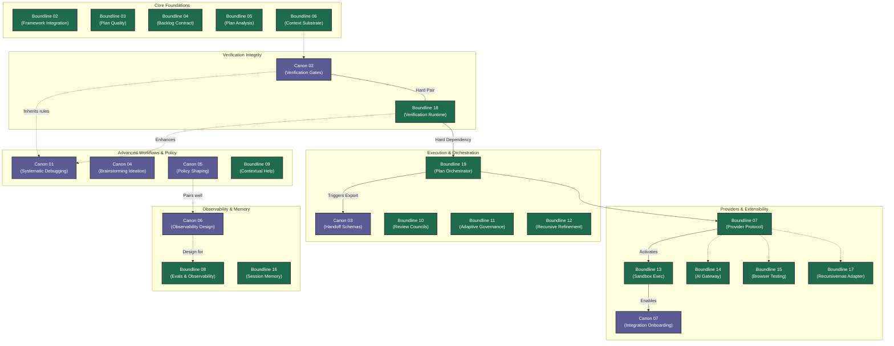

# Canon & Boundline Joint Feature Rollout

This document illustrates the operational sequence for the joint development of Canon and Boundline features. It encompasses all features from both roadmaps, grouping them by domain and showing critical execution dependencies.

## Dependency Graph

## Execution Order and Dependencies

1. **Core Foundations (Boundline 02-06)**
   - The foundational components for repository structure, configuration, basic backlog/plan logic, and context ingestion. These are largely independent precursors to execution engines.
2. **Canon 02 + Boundline 18 (Verification Pair)**
   - The first crucial execution juncture. Canon defines the `claim -> proof -> evidence_ref` contract, while Boundline implements the runtime that executes the proof and blocks task completion.
3. **Boundline 19 (Execution Orchestrator)**
   - Depends directly on `Boundline 18` to ensure that task ordering, checkpointing, and resume logic rely on a solid verification gate.
4. **Canon 03 (Parallel to 19)**
   - Defines purely the handoff/progress schema. It can be developed in parallel to the Boundline execution engine, or right before its integration to allow Boundline to export compatible packets.
5. **Boundline 07 -> Boundline 13 (Provider Layer)**
   - The actual external provider setup (MCP, setup, activation, health). `Boundline 07` comes first, followed by the security layer `Boundline 13` (secret inheritance and sandbox). It establishes the plugin layer that powers B14, B15, and B17.
6. **Canon 07 (After provider setup)**
   - Arrives at the end to close the loop on the CLI side (Canon init) by gathering local routing choices, delegating execution back to Boundline.
7. **Independent Features (Canon 01, 04, 05, 06 & Boundline 08-12, 16)**
   - These features cover autonomous workflows, policy, observability, and advanced orchestrator additions. They do not block the core engine loop and can be parallelized based on priority. 
   - *(Note on Canon 01: It has a soft dependency on Canon 02. While it can start immediately without hard blockers, once Canon 02 lands, Canon 01 will automatically inherit its rigid verification gates).*
